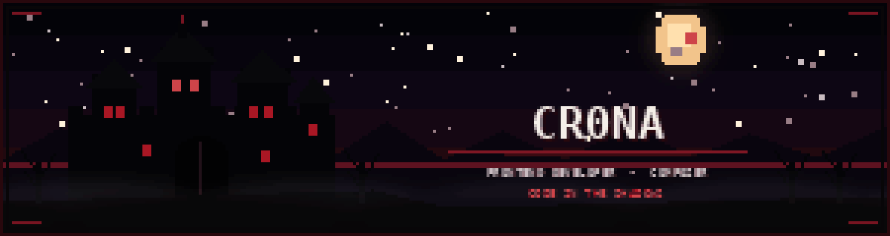

<div align="center">
  
</div>

<br>

<div align="center">

# 𖤐 CR0NA 𖤐

### Frontend Developer · Composer · Pianist & Organist

*Building digital worlds where code, art and atmosphere meet.*

<br>


</div>

---

## 🦇 About Me

```ts
const cr0na = {
  name: "Pedro",
  username: "Cr0na-cmyk",
  role: "Frontend Developer",
  location: "Brazil",

  interests: [
    "Web Development",
    "UI & UX",
    "Classical Music",
    "Dark Gothic Design"
  ],

  currentlyBuilding: [
    "World Dream Wall",
    "Sevora Wellness"
  ]
};
```

I am a frontend developer focused on building immersive, elegant and carefully structured digital experiences.

My work combines modern web development, visual identity and the same precision I bring to classical music and composition.

---

## 🩸 Languages & Technologies

<div align="center">


<br>


<br>


</div>

---

## 🕯️ Current Projects

### [World Dream Wall](https://github.com/Cr0na-cmyk/world-dream-wall)

A premium global platform designed to give every human dream a permanent place in the world.

`Next.js` · `React` · `TypeScript` · `Supabase`

### [Sevora Wellness](https://github.com/Cr0na-cmyk/sevora-wellness)

An evidence-focused digital wellness ecosystem built around reviews, comparisons, research and intelligent tools.

`Next.js` · `TypeScript` · `PostgreSQL` · `Artificial Intelligence`

---

## 🎼 Beyond Code

I am also a pianist, organist and composer.

Classical music shapes the way I approach software: structure, emotion, discipline and attention to every detail.

---

<div align="center">

### 𓆩 🩸 𓆪

**Code in the shadows. Music through the halls.**

</div>
